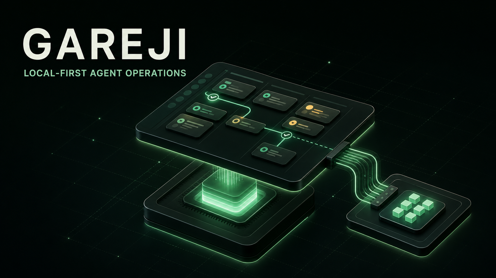

# Gareji Board

Gareji Board is a no-code workboard for human–AI teams. It makes autonomous work visible: what is ready, which custom agent is running it, what evidence it produced, and where it stopped.

## Product promise

People should not need to write automation code just to try an AI operating loop. Create work items, choose an agent profile, turn on an autopilot policy, and inspect the resulting evidence in one place.

Gareji Board is the reference product for [Gareji Core](https://github.com/Gareji-AI/gareji-core). The Board owns its user experience and local work state; Core owns trusted plugin execution, compact results, and audit sidecars.

## OpenAI Build Week

Gareji Board is the visible demonstration for the three-repository Gareji submission, together with [Gareji Core](https://github.com/Gareji-AI/gareji-core) and [Gareji MCP](https://github.com/Gareji-AI/gareji-mcp). Codex was used throughout the product design, Rust and JavaScript implementation, automated tests, and demo refinement. GPT-5.6 was used to reason across the three repository boundaries and to implement and review Control Graph behavior, Runner progress feedback, and the explicit safety boundary between disposable sample data and real user projects.

The demo shows the working project without an OpenAI API integration: a locally authenticated Codex CLI runs the explicit Agent Loop, while Board keeps candidate selection, progress, evidence, and human decisions visible.

## First demo

The initial seeded demo must work with bundled sample data and no account, API key, Obsidian installation, or external orchestration service. Starting a live Agent Loop additionally uses a locally installed, authenticated Codex CLI. It demonstrates:

1. A board using the Gareji work-item states `backlog`, `todo`, `in_progress`, `in_review`, `blocked`, `done`, and `cancelled`.
2. A user-selected custom agent profile for each eligible item, with a separately selectable Codex model.
3. An autopilot that deterministically selects one safe next item using Gareji Safe Autopilot stop, fast-exit, reconciliation, and candidate-skip semantics.
4. An evidence-first run record showing the decision, result, failure category when relevant, and the next human action.
5. A portfolio view that coordinates several projects without losing each project's state, limits, or approval gates.

The first real Knowledge Adapter is a **Markdown Zettelkasten**. The Board reads a configured project directory (for example, the user's `4_Project` convention) and treats its children as project context. Zettelkasten itself does not require this folder layout. Obsidian remains an optional editor for that Markdown, not the integration boundary or a required installation.

The bundled demo embeds a Markdown Knowledge workspace from `examples/demo-workspace` and a separate Agent fixture from `examples/demo-execution-workspace` into the CLI. Its three entries are labeled `Gareji Board · Sample`, `Gareji Core · Sample`, and `Sample Knowledge Plugin` so they cannot be mistaken for installed products. The demo uses only application-owned local fixture copies: it does not install a plugin, connect a user repository, or copy personal notes. Real plugins remain separately managed product projects outside this disposable workspace.

## Planned first launch

The first launcher exposes two choices:

- **Open sample** creates a resettable, disposable session from the bundled Knowledge and Execution workspace fixtures, including sample Agent instructions and Skills. The UI marks the session and every project card as a sample; it never writes into the bundled fixtures themselves.
- **Add existing project** connects a selected local repository or directory in place. Gareji Board stores a reference and permission policy; it does not move or copy the project.

The sample path is `gareji-board demo`; use `gareji-board demo --reset` to restore the copied fixture state first. From a source checkout, run `cargo run -p gareji-board-bridge --bin gareji-board -- demo --reset`. The launcher always uses its isolated application-owned demo database, copies both embedded workspaces, initializes the copied Execution workspace as its own local Git repository, and opens the desktop Board without reading `GAREJI_BOARD_DB`. When Core is installed, it also uses an isolated demo Core database and seeds the Activity view. A live Agent Loop resolves the native Codex executable and creates another isolated worktree. See [the architecture](docs/architecture.md) and [the onboarding design](docs/onboarding-design.md) for responsibility, connection, and trust rules.

## Runner and direct work

Work remains visible whether it was started by Gareji Runner or performed directly inside a connected project. Runner results, a manual `gareji checkpoint`, and a trusted Codex `Stop` Hook all emit the same immutable Progress Checkpoint. Gareji Board records it first, then projects an append-only progress note into every enabled write connection without turning those notes into additional task-state owners.

Knowledge Adapters are composable as well as replaceable. The bundled demo reads from and projects progress to both Markdown Zettelkasten and a dependency-free local JSON adapter at the same time; future GBrain and LLMWiki adapters keep the same Board and Checkpoint semantics.

See [the Progress Checkpoint design](docs/progress-checkpoint-design.md), [the Gareji MCP design](docs/mcp-design.md), and [the example event](examples/progress-checkpoint.json).

Gareji uses SQLite-backed state under the operating system's application-data location. Board-owned coordination records and Core-owned operational records remain behind separate Module Interfaces even if the implementation shares one database. JSON remains a fixture, import/export format, and demo Knowledge Adapter rather than the live control store.

GBrain and LLMWiki are future adapters: useful real-world integrations, not prerequisites for understanding or using the Board. One connected knowledge workspace may expose zero, one, or many projects; the Board keeps that source relationship visible instead of assuming that one app equals one project.

## Boundaries

- Do not turn the Board into an opaque general-purpose orchestrator.
- Do not let an autopilot execute arbitrary shell commands.
- Keep credentials and raw audit sidecars local and out of board data.
- Require explicit human approval for public, secret-bearing, destructive, or production-changing actions.
- Keep the first experience runnable from one command with bundled fixtures.

## Status

Public open-source development repository. The bundled demo remains isolated from personal repositories, notes, credentials, and private execution evidence.

See [the product brief](docs/product-brief.md), [the interface design](docs/ui-design.md), [the onboarding design](docs/onboarding-design.md), [the control semantics](docs/control-semantics.md), [the Runner design](docs/runner-design.md), and [the demo fixture](examples/demo-board.json).

Run the isolated sample with `cargo run -p gareji-board-bridge --bin gareji-board -- demo --reset`, or run the normal Tauri desktop with `cargo run -p gareji-board-app`. The embedded presentation needs no Node.js runtime or frontend server. The demo launcher copies the embedded Knowledge and Execution workspaces into an application-owned session, initializes the Execution copy as a local Git repository, seeds three projects and their graph bindings, connects the copied workspace, records two example Progress Checkpoints through an isolated Core database when Core is available, and opens the app with the demo database selected. The normal app uses the configured local Board database and loads recent Progress Checkpoints through a local `gareji-core bridge` when Core is installed. The Work surface groups items into canonical-state Kanban lanes and applies explicit guarded transitions. Safe Autopilot previews one deterministic candidate and its skip reasons before an explicit start runs the current Agent Loop in an isolated worktree. Automation exposes Control Graph and Blueprint workspaces where nodes can be added, connected, positioned, and published as immutable revisions. Gate, Audit, Approval, and Terminal authority remains enforced by Rust domain validation. `GAREJI_BOARD_DB`, `GAREJI_CORE_BIN`, `GAREJI_CORE_DB`, `GAREJI_CODEX_BIN`, and `GAREJI_RUN_ROOT` select explicit normal local state, Core, Codex, and Run storage. `cargo run -p gareji-board-bridge --bin gareji-board -- seed-sample` initializes the normal database explicitly for Core integration. Core capability composition remains pending.

Run headless Portfolio scheduling with `cargo run -p gareji-board-bridge --bin gareji-board -- portfolio-daemon`, or one diagnostic pass with `portfolio-tick-due`. On Windows, `powershell -ExecutionPolicy Bypass -File scripts/install-portfolio-scheduler.ps1` builds the release CLI, registers a hidden current-user logon task, and starts it immediately, so enabled Portfolio schedules continue while the desktop is closed. Scheduled passes advance at most one node per due revision, never start a project Runner, and leave Approval nodes waiting for a person.

Inspect and publish Control Graph or Blueprint node configuration with the `control-graph` and `blueprint` CLI command groups. Atomic JSON edit plans can add or remove nodes and connections while preserving immutable revisions and the same Rust validation used by the desktop. See [the CLI guide](docs/cli.md).

Validate code, documentation, schemas, references, and public-data hygiene with `cargo test --workspace` and `cargo xtask validate`. Contribution and security expectations are documented in [CONTRIBUTING.md](CONTRIBUTING.md) and [SECURITY.md](SECURITY.md).

## License

Licensed under [Apache License 2.0](LICENSE).
