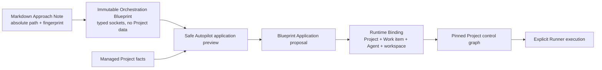
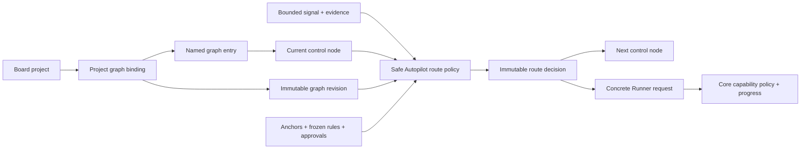

# Orchestration Blueprints and project control graphs

Status: visual Blueprint, application binding, Control Graph, Portfolio authoring, and local scheduling implemented; Blueprint-triggered Runner execution remains pending

## Product direction

Project orchestration is not authored inside a Project. Gareji Board owns reusable,
immutable **Orchestration Blueprint** revisions. A Project-scope Blueprint describes an
approach using typed sockets such as Context, Work item, Evidence, Artifact, Signal,
and Approval. Its Approach nodes pin Markdown **Approach Notes** by absolute path and
content fingerprint, but contain no Project identifier, workspace path, or Agent
profile assignment.

Safe Autopilot evaluates a Blueprint against the whole managed portfolio and proposes
which Projects can accept it. Accepting a proposal creates a **Blueprint Application**;
only then does Board resolve a concrete Project, Work item, Agent profile, Execution
workspace, and Knowledge context into a **Runtime Binding**. Preview never starts a
Runner or mutates Project state.

Portfolio orchestration uses the same model at a higher level. A Portfolio-scope
Blueprint selects Projects and invokes their existing Project control graphs, then
continues through bounded post-actions. This keeps reusable operating approaches
separate from the concrete products they are applied to.

The desktop now provides an editable Blueprint Studio with an Approach Note palette,
a visual typed-socket canvas, a pinned-note inspector, and application
preview results for all managed Projects. The built-in `evidence-first/v1` Blueprint
and its sample Markdown note exercise this flow. Blueprint revisions are stored
durably and validated before loading. A person can accept one preview candidate to
atomically store the Blueprint Application and its exact Project, Work item, Agent,
Execution workspace, and Approach Note pins; this still does not start a Runner or
change Work item state.

Approach Notes can be dragged or added from the palette and inherit their exact typed
socket contract. Gate, Audit, Approval, and Terminal stages can be added without a
Project binding. Node-to-node drag creates a bounded Flow; the keyboard-friendly
connection controls create either Flow or compatible typed-data links. Undo, Reset,
node/link removal, and immutable candidate revision saving are available. Drafts may
temporarily contain unreachable nodes, but Store accepts only a completely reachable,
fully validated revision. Portfolio Project Selector authoring is separate from Blueprint
editing and uses its own immutable Portfolio Draft Module.

## Existing project control graph runtime

Gareji Board should let each project select an inspectable operating structure instead of hiding a sequence of Agent loops inside prompts. The Board owns this structure as a **Control graph**. Gareji Safe Autopilot owns deterministic route selection within it. Runner executes the concrete stage selected by Board, and Gareji Core remains unaware of graph topology.

This design uses "graph engineering" as an emerging product-design direction, not as an established industry standard. It preserves loops as focused execution units and makes their organization, authority, evidence, and transitions explicit.

## Product promise

A person can answer four questions from the project screen before work starts:

1. Which Graph revision does this project use?
2. Which Graph entry starts this kind of work?
3. Which routes may Autopilot select, and why?
4. Which goals, rules, approvals, and evidence can the graph not rewrite?

During work, the same screen should show the current Control node, the selected route, its evidence, and any pending Graph rewrite proposal.

## Ownership

| Concern | Authoritative owner | Notes |
| --- | --- | --- |
| Graph revision, entries, nodes, routes, anchors | Board | Versioned coordination and policy configuration |
| Project graph binding | Board | Selects one revision and entry per project in v0 |
| Route decision and rewrite proposal | Board / Safe Autopilot | Deterministic, inspectable, evidence-linked |
| Agent profile and Work item assignment | Board | Referenced by graph nodes; remains separate from routing |
| Concrete process execution and workspace isolation | Runner | Receives an already selected stage; does not invent topology |
| Capability grants and trusted execution progress | Core | Evaluates concrete operations; never receives graph semantics |
| Knowledge context | Knowledge Adapter | Supplied by reference according to project policy |

The Control graph does not replace the Work item dependency graph. Dependencies express prerequisite work. Control routes express how one eligible Work item moves among execution, review, audit, approval, and terminal stages.

## Minimal model

One Graph revision contains:

- stable graph and revision identifiers;
- one or more named Graph entries;
- Control nodes representing focused Agent loops, deterministic gates, audit/review stages, approval boundaries, or terminal outcomes;
- named Control routes with a source, destination, bounded signal, and policy conditions;
- Graph anchors, frozen constraints, budgets, and approval requirements;
- optional deterministic rewrite triggers that can produce proposals only.

One Project graph binding selects an exact revision and one entry. In-flight work remains pinned to that revision. Changing the project default affects later work only.

## Route selection

Safe Autopilot may select a route only when all of the following are true:

- the current node and candidate route exist in the pinned revision;
- the observed signal is one of the route's declared bounded signals;
- the route is unique for the evaluated signal and policy priority;
- Work item eligibility, project capacity, Agent capability, budget, and approval preflights pass;
- the route cannot weaken a frozen constraint or Core capability policy;
- required evidence and counter-metrics are present.

A model may return a structured route proposal and explanation. It may not return an arbitrary next Agent profile, executable command, or new edge. Board validates the proposal against the pinned graph and records the accepted or rejected result without storing hidden model reasoning.

When no route is valid, Autopilot pauses or stops with a bounded reason. It must not guess a route.

## Dynamic reorganization

Route selection and graph rewriting are separate operations. V0 supports rewrite proposals for a small, explainable set of triggers:

| Observed condition | Proposed change |
| --- | --- |
| Repeated correction failures | Promote a specialist or stronger execution profile |
| Clustered failures | Add an independent review or audit node |
| Budget grows faster than verified progress | Collapse parallel fan-out |
| Work is below a configured size/risk threshold | Use a direct single-loop entry |

A proposal creates a candidate Graph revision. It does not modify the pinned revision. Changes to approval, audit, publishing, anchor, or authority relationships require explicit human approval. Automatically accepted low-risk changes must still be versioned and reversible.

## Grounding rules

Every automatically optimized path needs at least one independent counter-signal or anchor. Examples include tests that actually ran, a review result produced by a different stage, a human approval, or an external outcome received through a bounded Adapter.

Human-selected root goals and frozen constraints are not graph entries and cannot be rewritten by a route. Core capability policy remains independently authoritative even when a Board route is valid.

## First usable slice

The first implementation should deliver one thin vertical slice:

1. Store immutable Graph revisions with nodes, entries, routes, and anchors.
2. Let a project select its default revision and entry.
3. Add a read-only graph panel showing the selected entry and all permitted routes.
4. Resolve a bounded route for the current Work item through deterministic Safe Autopilot policy.
5. Record and display the Route decision before Runner execution.
6. Allow manual selection among permitted entries and routes.
7. Represent dynamic changes only as approval-gated rewrite proposals.

Initial demo graphs should be small and named by intent, for example:

- `direct`: implement -> verify -> finish;
- `reviewed`: research -> implement -> independent review -> verify -> finish;
- `high-risk`: plan -> human approval -> implement -> audit -> human acceptance.

### Current implementation

The Board now stores validated immutable Graph revisions and optimistic Project graph bindings. The desktop Project card can select a built-in `direct`, `reviewed`, or `high-risk` revision and one of its named entries, then shows its stage, route, and anchor counts.

Schema version 14 retains the behavior introduced in version 11: eligible Work items are pinned to an exact revision, entry, and current node before the first Agent Loop execution. Deterministic Route decisions advance that position atomically with evidence references, reject a model proposal that differs from the declared route, and remain idempotent by decision identity. Agent Loop nodes resolve to a concrete Agent profile target that a controller can use to construct the existing Runner request, while non-Agent nodes fail closed. The Project card displays persisted active positions when present.

The combined Runner completion API now records the Runner result through Core, then uses the accepted Checkpoint as evidence to advance one declared route. `completed` maps to the unique `succeeded`, `passed`, or `needs_approval` route, `progress` stays on the current node, and blocked or failed work uses a unique `failed` or `rejected` route or pauses safely when none exists. Results from an Agent profile other than the current Agent Loop target cannot advance the graph.

The desktop Safe Autopilot preview now exposes an explicit **Start current Agent Loop** action for its selected candidate. A Board controller pins the Graph position, resolves the current Agent profile and connected local Execution workspace, repeats Runner validation, executes in a background isolated worktree, records the result through Core, and then applies the trusted Checkpoint to the declared route. The UI reloads the durable Activity and Graph position after completion; a Core or Graph failure remains visible instead of being reported as success.

Gate and Audit nodes now expose only their declared routes and require a non-empty evidence reference before a route can be recorded. Approval nodes appear behind an explicit human-confirmation control and accept only `approved` or `rejected` routes. Graph validation prevents any non-Approval node from claiming `approved`, so a model, Agent Loop, or evidence Gate cannot manufacture human authority. Terminal nodes are displayed as complete and cannot start a Runner.

Each Project card now exposes its immutable Route decision history in recorded order. Every entry shows the Work item, bounded Signal, source and destination nodes, selected route, and evidence references. The read model is filtered by Project in Store, so a portfolio view cannot mix another Project's decisions into the card.

Each Project card now includes a visual Graph builder. It automatically lays reachable nodes out from left to right by their distance from a fixed entry, draws directional route curves between their visible cards, and keeps unconnected draft nodes visible in a final column. A person can select a node directly on the map, drag one node onto another to connect them with the selected bounded signal, use the equivalent keyboard-friendly connection controls, add an Agent Loop, Gate, Approval, Audit, or Terminal, remove connections, remove non-entry nodes, or replace one Agent Loop's profile. Undo reverses one draft edit; Reset restores the live revision while remaining undoable. The editor computes a bounded topology delta instead of accepting a hidden full graph. Entries and anchors remain fixed, every node must be reachable from an entry, Approval routes are limited to human outcomes, Terminal nodes cannot start a route, and existing node or route definitions cannot be mutated in place.

The portfolio also exposes one All project graphs workspace. Every managed project remains visible as a project selector, and choosing one opens the same graph-binding, visual-draft, active-position, route-history, and approval Interface used by its Project card. The workspace does not introduce a second write path or a global mutable Graph: each edit still targets one explicit project and its expected pinned revision.

Portfolio-wide coordination is a separate graph layer rather than one oversized Control graph. A Portfolio orchestration graph contains Project Selector nodes, bounded post-actions, and a terminal outcome. A selector considers all managed projects or an explicit subset at tick time, then resolves the chosen project's exact Project graph binding. The project's own Control graph continues to own its internal Agent Loop, Gate, Audit, Approval, and Terminal routing. Cross-project routes carry only bounded orchestration signals such as `completed`, `no_candidate`, or `needs_attention`.

The desktop stores immutable revisions and provides a graph plus a safe current-node preview. The built-in v2 graph uses one enabled hourly `All managed` Project Selector, then a summary post-action and terminal node. Selection limits Safe Autopilot to one candidate and fails closed when the selected project's Control graph revision cannot be resolved. Preview never starts a Runner.

Portfolio Runs are durable and pinned to an immutable revision. The shared `PortfolioScheduler` Module checks enabled cadences from either the open desktop or a finite `gareji-board portfolio-tick-due` process; a due or manually requested tick previews, appends one Run step, and advances at most one route transactionally. Completed runs retain the next cadence checkpoint so a later tick starts a new Run. Competing desktop and OS wake-ups compare the exact latest Run inside an immediate SQLite transaction, so only one can record the step or create a successor Run. A tick never starts a project Runner. A runtime Schedule Control can pause and resume automatic ticks without changing the Run position, while manual one-node execution remains available. Approval post-actions pause in `waiting_approval`; an explicit human Approved or Rejected decision is appended as another Run step and can select only the matching declared route.

The Portfolio editor opens an immutable revision as a local draft. A person can change manual or interval cadence, add an all-managed or explicit-subset Project Selector, Summary, Approval, or Terminal node, connect nodes by dragging or keyboard-friendly controls, remove nodes and routes, Undo, Reset, and save a fully reachable candidate revision. Editing permits temporarily unconnected nodes, but the Store accepts only a fully validated immutable revision. Local OS task registration keeps the finite Scheduler Adapter active while the desktop is closed without adding a Board daemon; execution while no user session is available remains outside this slice.

Every edit becomes an approval-gated Graph rewrite proposal with its rationale, evidence, and complete candidate revision. The candidate remains outside the normal Graph catalog and cannot affect the Project binding while pending. Explicit approval atomically publishes the candidate and selects it for future work; existing Work item graph positions remain pinned to the source revision. Rejection records the final decision without publishing or changing the Project binding. Model-owned topology or authority changes remain out of scope.

Selecting a graph or approving a candidate records Project intent only; execution still begins only through an explicit desktop start action.

## Non-goals for v0

- silent in-place self-modification;
- free-form model-selected nodes or edges;
- rewriting Graph entries or anchors in the visual builder;
- moving Work item state ownership into the graph;
- encoding graph payloads in the Core protocol;
- a generic remote workflow engine or graph registry;
- treating ordinary metrics as sufficient evidence without counter-metrics or anchors.

## Research basis

The design follows [12-Factor Agents](https://github.com/humanlayer/12-factor-agents/tree/d20c728368bf9c189d6d7aab704744decb6ec0cc), particularly its guidance to own control flow and use focused agents inside a mostly deterministic system. It also incorporates the newer distinction between programmable agent behavior and programmable agent organizations discussed by [Shubham Saboo](https://x.com/Saboo_Shubham_/status/2078301249376825397), together with the grounding, counter-metric, audit, and anchor cautions in [Carlos E. Perez's article](https://x.com/IntuitMachine/status/2078419526354378975).
